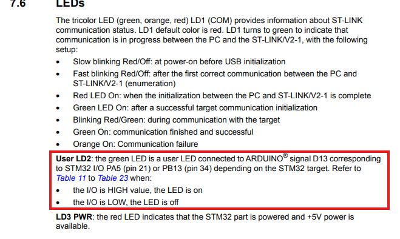
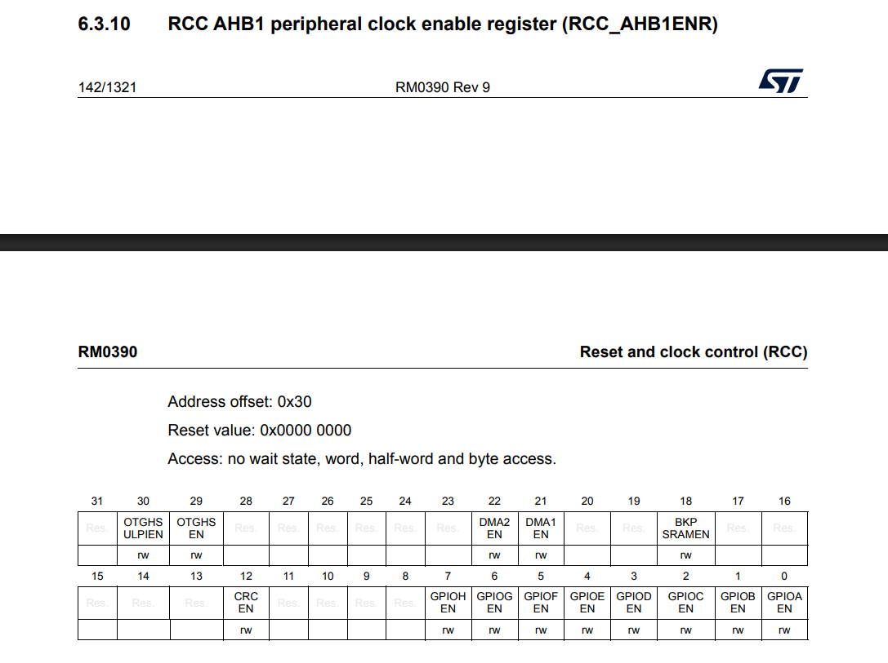
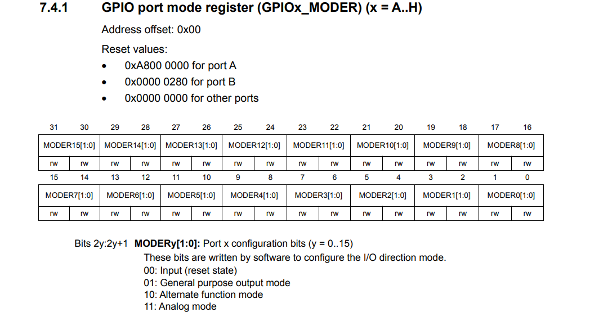
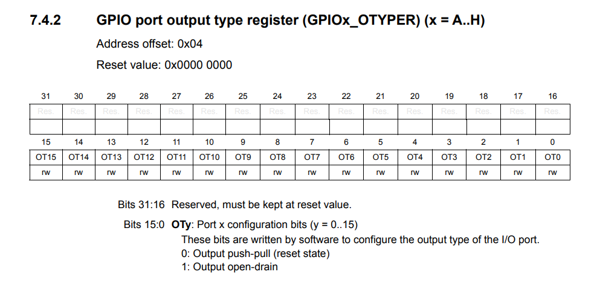
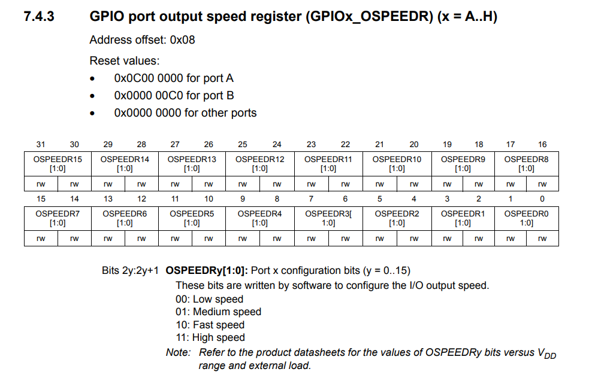
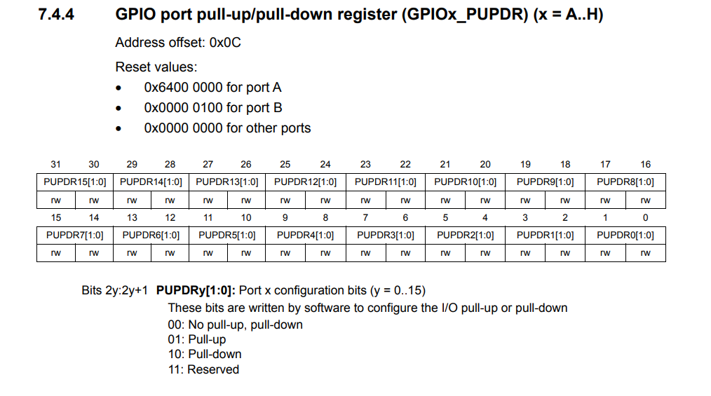
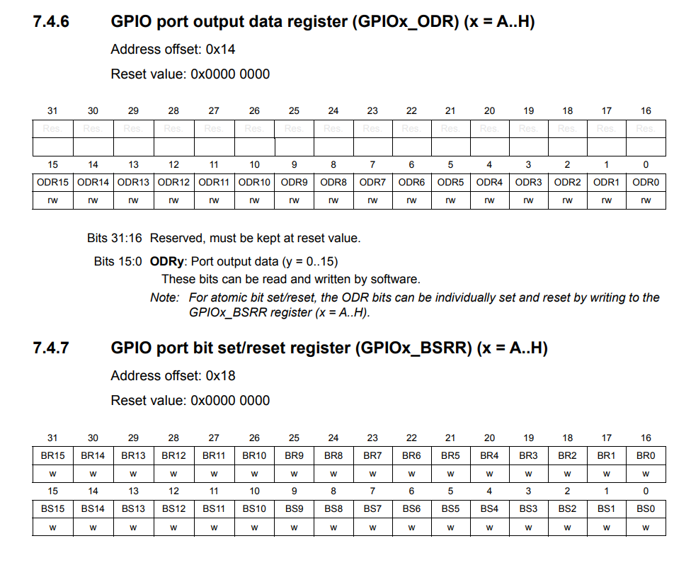

# STM32 GPIO LED BLINK

# Project Setup 
First an STM32 project was created. Missing include files were added from the following filepaths:
"STM32Cube\Repository\STM32Cube_FW_F4_V1.27.0\Drivers\CMSIS\Device\ST\STM32F4xx\Include" "STM32Cube\Repository\STM32Cube_FW_F4_V1.27.0\Drivers\CMSIS\Include" 

Including these file path in the project lets us use the hardware specific header file that contains all the register adresses.

# Planning
The goal is to blink and LED. Lets find LED pin from reference manual



Since the pin is PA5, it is part of the GPIOA port, so GPIOA needs to be enabled. For the GPIOA to be enabled, the GPIOA CLK needs to be enabled. Then the PA5 pin needs to be configured as an output. Now the pin can be ON and reset repeatedly in the for loop 100 times. 

# Bitmasking
Bitmasked is performing using the following operations:
```
&   AND

|   OR

~   NOT

<<  left shift

&=  AND Assignment

|=  OR Assignment
```

# Code

First, the clock needs to be enabled. RCC controls the clocks of the system preipherals. AHB1ENR represents a memory adress that is the RCCs clock enable register specifically for the AHB1 pherhiperal. The reference sheet shows that the first bit in the AHB1ENR regisster is the GPIOA Enable, so this will be turned on with the RCC_AHB1ENR_GPIOAEN bitmask.



```
RCC->AHB1ENR |= RCC_AHB1ENR_GPIOAEN;
```

To turn the clock on the value (11)<sub>2</sub> which is (3)<sub>10</sub> is shifted by 10 bits. 10 bits because 5 pins have 2 bits each. This resets all the bits for the 5th pin of the GPIO port. Then the value (01)<sub>2</sub> which is (1)<sub>10</sub> is shifted by 10 bits. This sets the 5th pin of the GPIO port to 01 which is a digital output, as stated on the reference manual.
```
GPIOA->MODER &= ~(3U << (5 * 2));
GPIOA->MODER |=  (1U << (5 * 2));
```



The following lines configure the pin. 
```
GPIOA->OTYPER &= ~(1U << 5);
GPIOA->OSPEEDR &= ~(3U << (5 * 2));
GPIOA->PUPDR &= ~(3U << (5 * 2)); 
```
We want default push pull operation of pin so it is set to 0, using the same bitmasking concept and the provided adresses in the header file. The speed of the pin, set to low speed with 00. The pin is then configured to have no pull up or pull down resistor, since we would like to turn the pin on and off.





Since we are only changing the pin from high to low, we can user BSRR to turn the led on and off with a delay function to see the light turn off. using BSRR removes the need to read the register.

```
for(int i = 0;i<100;i++){
    GPIOA->BSRR = (1U << 5);       // PA5 HIGH
    delay(100000);

    GPIOA->BSRR = (1U << (5 + 16)); // PA5 LOW
    delay(100000);
};
```
